<p align="center">
  <picture>
    <source media="(prefers-color-scheme: dark)" srcset="https://img.shields.io/badge/Flutter-3.44+-02569B?style=for-the-badge&logo=flutter&logoColor=white">
    
  </picture>
  <a href="https://github.com/kido-luci/flutter-starter-template/blob/main/LICENSE"></a>
  <a href="https://luci-studio.com"></a>
</p>

<p align="center">
  <a href="https://github.com/kido-luci/flutter-starter-template/actions/workflows/ci.yml"></a>
  <a href="https://github.com/kido-luci/flutter-starter-template/actions/workflows/codeql.yml"></a>
  <a href="https://github.com/kido-luci/flutter-starter-template/actions/workflows/release.yml"></a>
</p>

<h1 align="center">
  <br>
  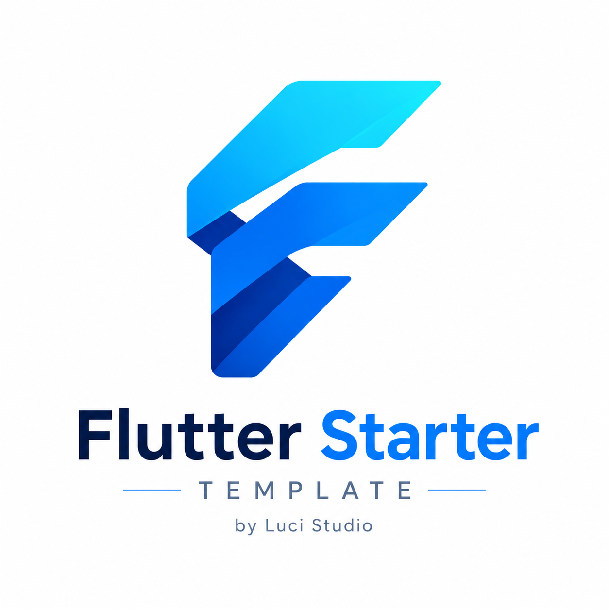
  <br>
  
  <br>
</h1>

<p align="center">
  <i>A production‑ready Flutter foundation: modular Clean Architecture,<br>offline‑first sync, JWT auth, Firebase, and a companion Go reference backend.</i>
</p>

<p align="center">
  
</p>

<br>

**Flutter Starter Template**, built by [Luci Studio](https://luci-studio.com), is an enterprise-grade mobile boilerplate engineered for building scalable, high-performance cross-platform applications. It solves the complex challenges of bootstrapping new projects by providing a production-ready structure out of the box. This template features strict Clean Architecture layers, robust offline-first synchronization, secure JWT credential lifecycle management, and pre-configured Firebase integrations.

To enable seamless local development and testing, this template is paired with a companion SQLite-backed backend server written in Go, allowing you to test authentication flows, CRUD operations, and sync conflict resolution under real network conditions.

<br>

<details>
<summary><b>📑 Table of Contents</b></summary>
<br>

- [✨ What's Inside](#-whats-inside)
- [📸 Screenshots](#-screenshots)
- [🧬 Architecture](#-architecture)
  - [📁 Feature Slice (Clean Architecture)](#-feature-slice-clean-architecture)
- [🚀 Quick Start](#-quick-start)
- [🧪 Testing & Code Quality](#-testing--code-quality)
- [🔄 Git Workflow & PRs](#-git-workflow--prs)
- [🔥 Firebase](#-firebase)
- [🍦 Flavors & Environment](#-flavors--environment)
- [🚀 Release (Fastlane)](#-release-fastlane)
- [📶 Offline‑First Sync](#-offlinefirst-sync)
- [🔗 Deep Linking](#-deep-linking)
- [🧩 UI Widgets](#-ui-widgets)
- [🧰 Tech Stack](#-tech-stack)
- [🤖 AI‑Native Workflow](#-ainative-workflow)
- [🔄 Code Generation](#-code-generation)
- [🌐 Localization (i18n)](#-localization-i18n)

</details>

<br>

---

<br>

## ✨ What's Inside

|                           |                            |
|---------------------------|----------------------------|
| 🏛 **Clean Architecture** | Data / domain / presentation layers with full dependency inversion |
| 🧩 **BLoC + Freezed**     | Bloc pattern with sealed state unions and exhaustive `when` |
| 📶 **Offline‑First**      | Reusable `sync` engine — ObjectBox local writes → revision‑based delta sync → tombstones → conflict detection |
| 🔐 **JWT Auth**           | Access + refresh tokens, auto‑refresh interceptor, secure storage |
| 🧭 **Declarative Routing**| `go_router` with typed routes, auth guards, Universal Links & App Links |
| 🎨 **Theming**            | Material 3, `FlexColorScheme`, Google Fonts (Inter), true black OLED dark mode |
| 🌐 **i18n**               | ARB‑based localization — English + Vietnamese out of the box |
| 🔥 **Firebase**           | Crashlytics, Analytics, Messaging — all wired up |
| 🔔 **Notifications**      | On‑device scheduling + tap‑to‑navigate |
| 💉 **DI**                 | `get_it` + `injectable` code‑gen — zero manual wiring |
| 📡 **REST**               | `Retrofit` + `Dio` typed clients with auth interceptor |
| ⚙️ **Go Backend**         | Companion server — `chi/v5`, JWT issuer, bookmark & collection CRUD, uploads |
| 🤖 **AI-Native**          | Rules, MCP servers, and agent skills for Claude, Cursor, Codex, Command Code, and Antigravity |
| 🚀 **Release CI**         | Fastlane lanes — iOS → TestFlight, Android → Play — flavor‑aware, wired to GitHub Actions |

<br>

---

<br>

## 📸 Screenshots

<p align="center">
  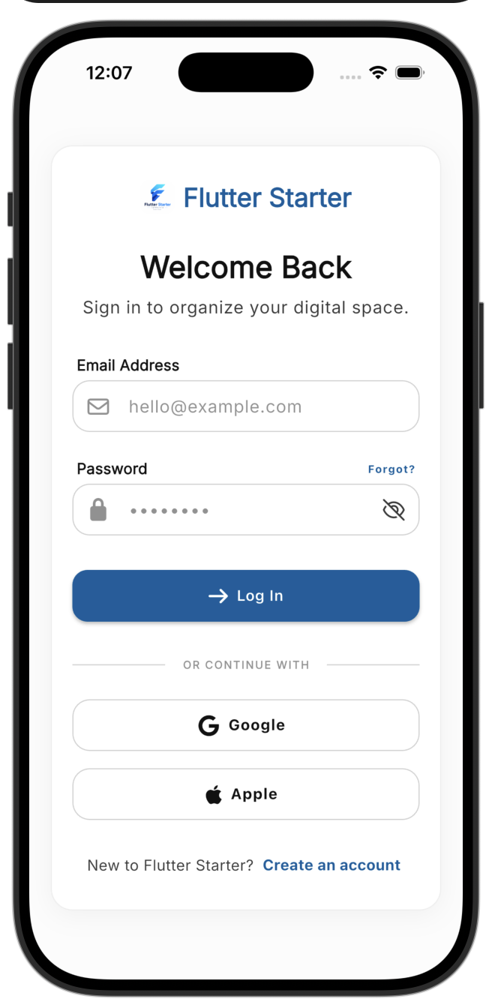
  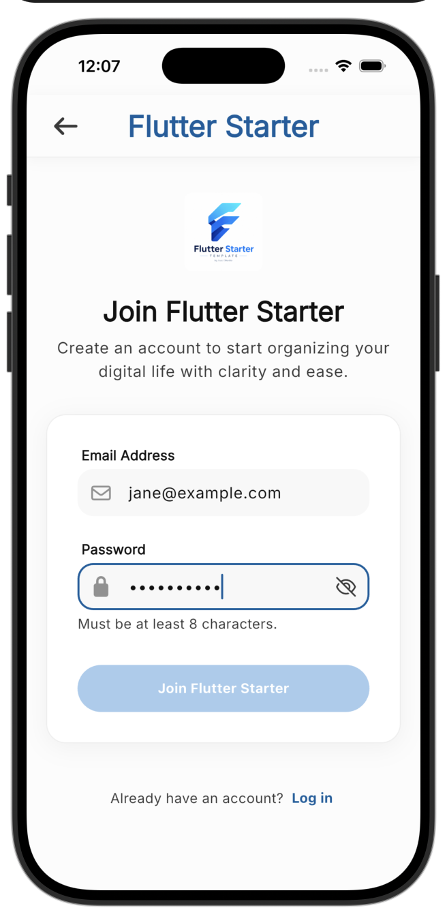
  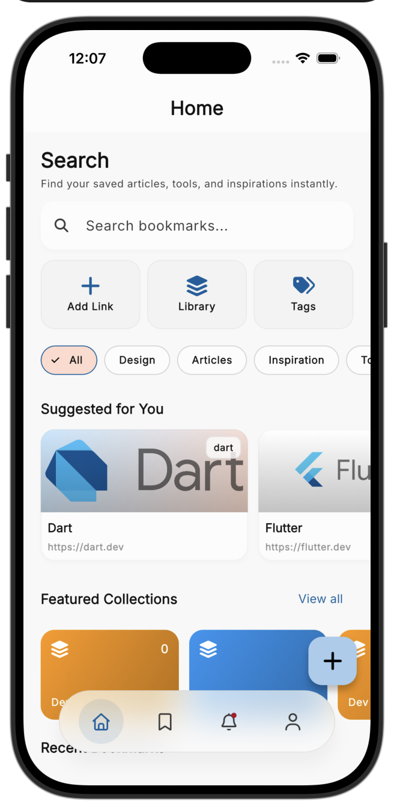
  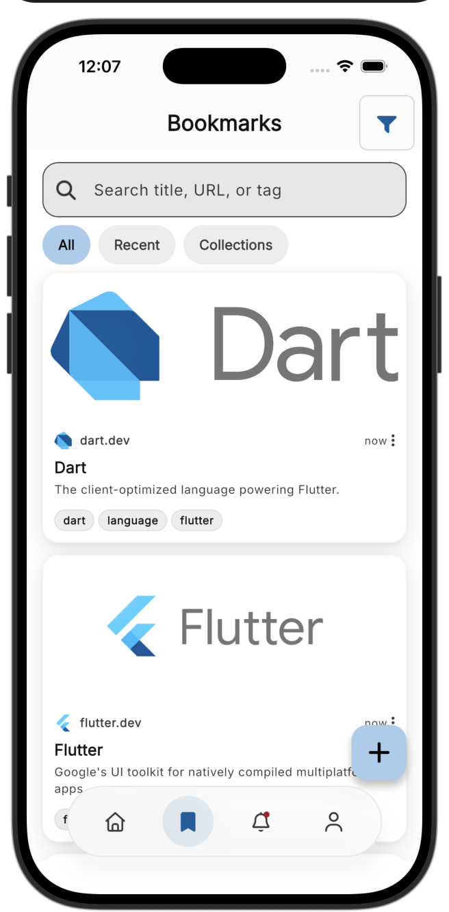
</p>
<p align="center">
  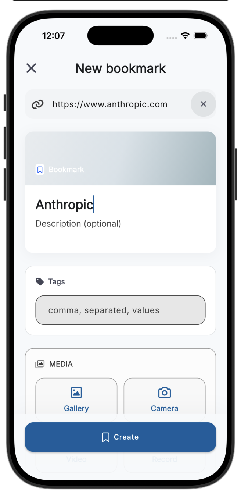
  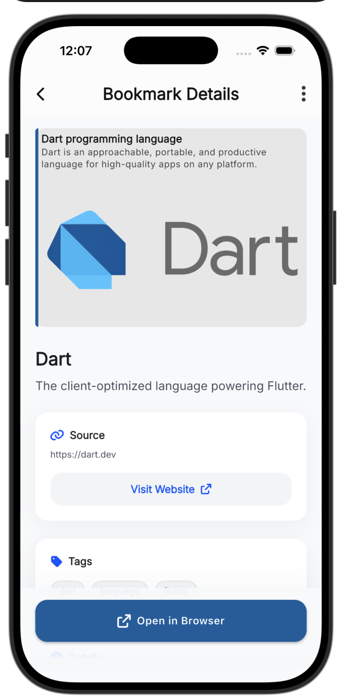
  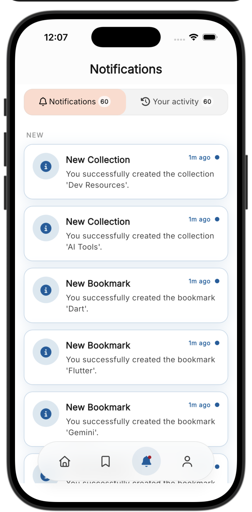
  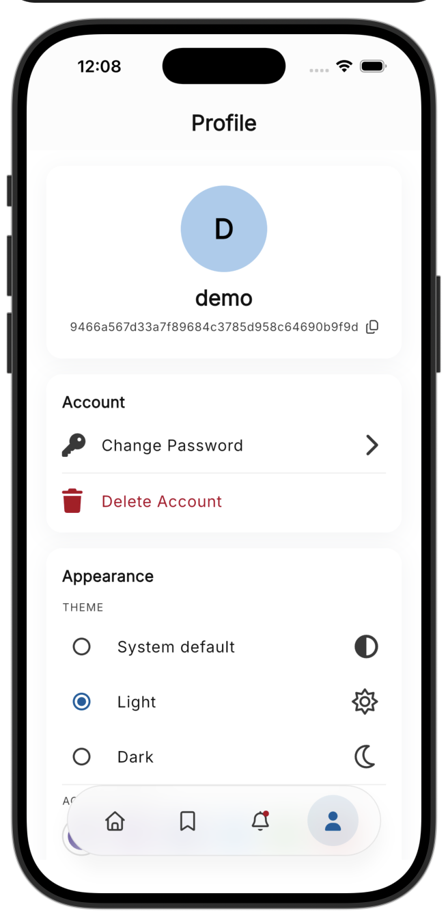
</p>

<p align="center"><sub>JWT auth · Material 3 · offline‑first bookmarks & activity feed</sub></p>


<br>

---

<br>

## 🧬 Architecture

<p align="center">
  
</p>

```
.
├── lib/                              # Root Flutter app package
│   ├── main.dart                     # Entry: DI → Firebase → runApp
│   ├── app/
│   │   ├── app.dart                  # MaterialApp.router + providers
│   │   ├── router.dart               # TypedGoRoute + auth redirect
│   │   └── widgets/                  # App-level shell widgets
│   ├── core/
│   │   ├── data/database/            # ObjectBox wrapper and generated store binding
│   │   ├── di/                       # get_it + injectable app graph
│   │   ├── extensions/               # App-specific convenience extensions
│   │   └── platform/firebase/        # App bootstrap for Firebase services
│   ├── features/
│   │   ├── auth/                     # Sign-in, sign-out, session restore
│   │   ├── bookmarks/                # CRUD, offline sync, list/detail/form
│   │   ├── collections/              # Group bookmarks into folders, offline sync
│   │   ├── home/                     # Home dashboard
│   │   ├── notifications/            # Notification and activity feed
│   │   ├── profile/                  # User info + account actions
│   │   └── splash/                   # Session restoration gate
│   ├── gen/                          # flutter_gen asset references
│   ├── l10n/                         # ARB files + generated localizations
│   └── shared/                       # App-level shared domain/presentation contracts
├── packages/                         # Dart Pub Workspace members
│   ├── app_ui/                       # Design system, theme, layout, reusable widgets
│   ├── analytics/               # Analytics service + route observer
│   ├── config/                  # EnvConfig + Remote Config wrapper
│   ├── architecture/                  # Failure, Result, UseCase primitives
│   ├── network/                 # Dio, Retrofit, retry/performance interceptors
│   ├── app_platform/                # Camera, picker, permissions, notifications, share
│   ├── storage/                 # SharedPreferences and secure storage helpers
│   ├── sync/                     # Reusable offline-first sync engine (scheduler + delta CRUD)
│   ├── theme/                   # ThemeBloc and persisted theme state
│   └── test_utils/                   # Shared mocks, images, and mocktail export
├── test/                             # Root app tests only
└── integration_test/                 # Device/emulator integration tests
```

<p align="center">
  
</p>

The repository uses Dart Pub Workspaces. The root package is the assembled
Flutter app: routing, DI composition, app-only features, ObjectBox entities, and
Firebase bootstrap stay there. Reusable infrastructure lives in `packages/` and
is consumed through package entry points such as `package:network/network.dart`.

Workspace packages own their third-party implementation details. For example,
the root app depends on `network`, not directly on `dio` or `retrofit`;
`network` exports those APIs when the app needs the types. The same pattern
keeps platform, storage, analytics, theme, and UI dependencies versioned in one
place and avoids root-package dependency conflicts.

All shared UI lives in `packages/app_ui` and is consumed through
`package:app_ui/app_ui.dart`; add new generic widgets there. Package-owned tests
live beside their package in `packages/<name>/test`, while root app tests stay
under `test/`.

<p align="center">
  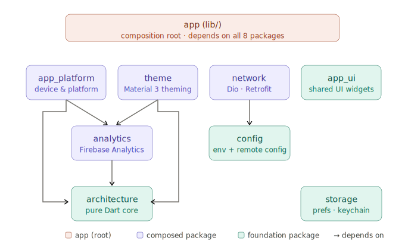
</p>

<p align="center">
  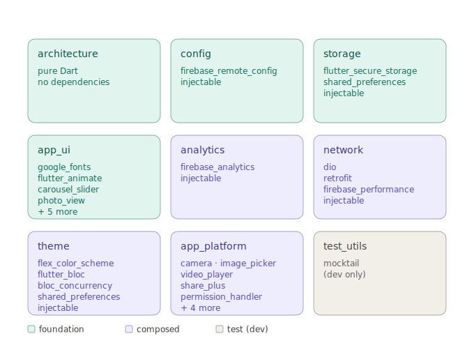
</p>

### 📁 Feature Slice (Clean Architecture)

<p align="center">
  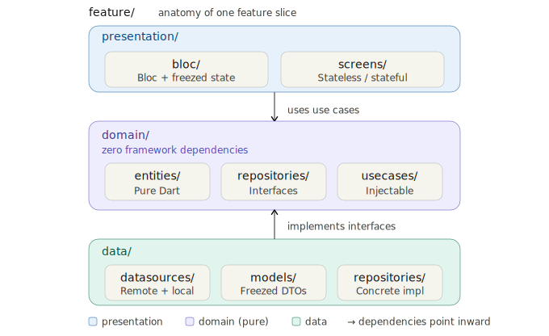
</p>

```
feature/
├── data/
│   ├── datasources/        Remote (Retrofit) + Local (ObjectBox / secure storage)
│   ├── models/             Freezed DTOs with toDomain() mappers
│   └── repositories/       Concrete implementations
├── domain/
│   ├── entities/           Pure Dart classes — zero framework deps
│   ├── repositories/       Abstract interfaces
│   └── usecases/           Single‑purpose, injectable
└── presentation/
    ├── bloc/               Bloc + freezed state
    └── screens/            Stateless/Stateful widgets
```

<br>

---

<br>

## 🚀 Quick Start

### 📋 Prerequisites

| Tool    | Version | Notes |
|---------|---------|-------|
| Flutter | ≥ 3.44  | Managed via [FVM](https://fvm.app/) — see `.fvmrc` |
| Go      | ≥ 1.25  | Backend server |
| Node.js | ≥ 18    | Optional — only for the `firebase` MCP server (`npx`) |

### ⚡ Install & Generate

```bash
# --recurse-submodules pulls the companion Go backend (a git submodule)
git clone --recurse-submodules https://github.com/kido-luci/flutter-starter-template.git
cd flutter-starter-template

fvm flutter pub get
fvm dart run build_runner build --delete-conflicting-outputs
```

> 💡 **Already cloned without submodules?** Run
> `git submodule update --init --recursive` to fetch the backend.

### 🍎 iOS one-time setup

iOS builds must use CocoaPods, **not** Swift Package Manager — Firebase needs an
iOS 15.0 deployment target, but Flutter 3.44.0 hardcodes the SPM-generated
package to 13.0, and two plugins (`permission_handler_apple`,
`objectbox_flutter_libs`) don't support SPM yet. This setting lives in a
machine-global Flutter config (`~/.config/flutter/settings`), so **every new
machine and CI runner must run it once** before the first iOS build:

```bash
fvm flutter config --no-enable-swift-package-manager
```

### 🖥 Start Backend

The backend lives in the [`simple_backend_server`](simple_backend_server) git
submodule. If it's empty, run `git submodule update --init --recursive` first.

```bash
cd simple_backend_server
go run .                    # → http://localhost:8080
```

| Method   | Endpoint                      | Description               |
|----------|-------------------------------|---------------------------|
| `GET`    | `/health`                     | Health check              |
| `POST`   | `/api/auth/register`          | Register a new account    |
| `POST`   | `/api/auth/sign-in`           | Sign in                   |
| `POST`   | `/api/auth/refresh`           | Refresh access token      |
| `POST`   | `/api/auth/sign-out`          | Revoke refresh token      |
| `GET`    | `/api/auth/me`                | Current user              |
| `POST`   | `/api/auth/change-password`   | Change password           |
| `POST`   | `/api/upload`                 | Upload an attachment      |
| `GET`    | `/api/bookmarks`              | List bookmarks (`?since=<rev>` for delta sync) |
| `POST`   | `/api/bookmarks`              | Create bookmark           |
| `GET`    | `/api/bookmarks/:id`          | Get bookmark              |
| `PUT`    | `/api/bookmarks/:id`          | Update bookmark (`X-Expected-Rev` → `409`) |
| `DELETE` | `/api/bookmarks/:id`          | Delete bookmark (soft‑delete tombstone) |
| `GET`    | `/api/collections`            | List collections (`?since=<rev>` for delta sync) |
| `POST`   | `/api/collections`            | Create collection         |
| `GET`    | `/api/collections/:id`        | Get collection            |
| `PUT`    | `/api/collections/:id`        | Update collection (`X-Expected-Rev` → `409`) |
| `DELETE` | `/api/collections/:id`        | Delete collection (soft‑delete tombstone) |
| `GET`    | `/api/notifications`          | List notifications        |
| `GET`    | `/api/activity`               | List activity feed        |

> 💡 **Tip** — Any username + password works during development.

> 🔄 **Sync protocol** — Bookmarks and collections carry a per‑owner `rev`
> (monotonic revision) and `deleted_at` tombstones. Clients pull deltas with
> `?since=<rev>` and send `X-Expected-Rev` on writes for optimistic‑concurrency
> conflict detection (`409`). See [Offline‑First Sync](#-offlinefirst-sync).

### 📱 Launch App

```bash
fvm flutter run
```

<br>

## 🧪 Testing & Code Quality

This template includes a robust set of automated tests and static analysis configuration to ensure code quality.

### 🏃 Running Tests

Root app tests mirror the `lib/` feature structure. Package-owned tests live
beside the package they cover under `packages/<name>/test`.

```bash
# Run root app unit and widget tests
fvm flutter test --exclude-tags golden

# Run a specific test file
fvm flutter test test/widget_test.dart

# Run tests by name match
fvm flutter test --name "signs in"

# Run a package's own tests
(cd packages/network && fvm flutter test)
```

Shared mocks and test fixtures live in `packages/test_utils` and are exported
through `package:test_utils/test_utils.dart`; root-only fixtures remain in
`test/test_utils/`.

CI runs root tests with coverage, then runs each package test suite with
coverage and merges the LCOV reports before enforcing the workspace coverage
threshold. Golden tests are excluded in CI because baselines are generated on
macOS while CI runs on Ubuntu.

Refer to the [test/README.md](test/README.md) file for detailed testing
guidelines and patterns.

### 🧭 End-to-End Testing

Unlike the unit/widget/bloc suites above — which mock every boundary —
`integration_test/` runs a single real-backend journey: it boots the actual
assembled `App` (real DI, real Firebase, **no mocks**) against the local
`simple_backend_server` and walks one self-seeded user through every feature —
register, bookmarks, collections, notifications, sign-out — proving the real
Dio client → repositories → use cases → backend → SQLite all wire together.

```bash
tool/run_e2e.sh                 # one shot: reset + start backend, run, tear down
tool/run_e2e.sh <device-id>     # target a specific `flutter devices` id
```

It needs a booted **iOS Simulator** (not macOS — only `ios/` ships a
`GoogleService-Info.plist`) and isn't run in CI, since it requires a live
backend and emits real Firebase telemetry. Run it locally before cutting a
release. See [integration_test/README.md](integration_test/README.md) for
details, gotchas, and how to run it manually against an already-running
backend.

### 🔍 Static Analysis & Linting

Verify lint rules, formatting, and type safety before committing:

```bash
# Analyze code for warnings and errors
fvm flutter analyze

# Automatically apply quick fixes
fvm dart fix --apply

# Format all Dart files
fvm dart format .
```

<br>

## 🔄 Git Workflow & PRs

The `main` branch is protected — all changes land through Pull Requests, with
**CodeRabbit** AI review and **CodeQL** security scanning on every PR.

The full contributor workflow — branch naming, the local verification gate, the
pre-push hook, opening a PR, and the AI review / security tooling — lives in
[**`CONTRIBUTING.md`**](CONTRIBUTING.md).

```bash
# The local gate CI enforces — run before pushing
fvm dart format .
fvm flutter analyze
fvm flutter test --exclude-tags golden
```

<br>

---

<br>

## 🔥 Firebase

Crashlytics + Analytics + Messaging — pre‑configured and ready to connect.

```bash
fvm dart pub global activate flutterfire_cli
flutterfire configure                          # → lib/firebase_options.dart
```

Drop these into your project:
- `android/app/google-services.json`
- `ios/Runner/GoogleService-Info.plist`

Firebase initializes in `lib/main.dart` with Crashlytics fatal‑error reporting on both Flutter and platform threads.

<br>

---

<br>

## 🍦 Flavors & Environment

Three build flavors driven by `--dart-define` with typed runtime config:

| Flavor    | Android App ID                                    | iOS Bundle ID                                |
|-----------|---------------------------------------------------|----------------------------------------------|
| `dev`     | `com.lucistudio.flutter_starter_template.dev`     | `com.luci-studio.flutterStarterTemplate.dev` |
| `staging` | `com.lucistudio.flutter_starter_template.staging` | `com.luci-studio.flutterStarterTemplate.staging` |
| `prod`    | `com.lucistudio.flutter_starter_template`         | `com.luci-studio.flutterStarterTemplate`     |

```bash
fvm flutter run --flavor dev     --dart-define-from-file=env/dev.json
fvm flutter run --flavor staging --dart-define-from-file=env/staging.json
fvm flutter run --flavor prod    --dart-define-from-file=env/prod.json
```

`EnvConfig` (`packages/config/lib/config.dart`) surfaces API base URL,
Firebase project IDs, and flavor name from `String.fromEnvironment` at startup.

<br>

---

<br>

## 🚀 Release (Fastlane)

iOS → TestFlight and Android → Google Play are automated with [Fastlane](https://fastlane.tools),
one flavor‑aware `beta` lane per platform. Every credential is read from a
git‑ignored `.env` (plus `key.properties` on Android), so nothing secret is
committed — fill those in and go.

```bash
cd ios     && bundle exec fastlane beta flavor:prod   # → TestFlight
cd android && bundle exec fastlane beta flavor:prod   # → Google Play
```

- **Signing** — iOS uses [`match`](https://docs.fastlane.tools/actions/match/)
  (cert + profiles in a private repo); Android uses an upload keystore wired via
  `android/key.properties` (falls back to debug signing when absent, so the
  template still builds out of the box).
- **Build numbers** auto‑increment (lane arg → `BUILD_NUMBER` → git commit
  count) so repeated uploads are never rejected.
- **CI** — [`.github/workflows/release.yml`](.github/workflows/release.yml) runs
  both lanes on a `v*` tag push or manual dispatch (macOS for iOS, Linux for
  Android), restoring the git‑ignored Firebase configs and signing assets from
  repository secrets.

Setup steps and the full list of required secrets live in
[`ios/fastlane/README.md`](ios/fastlane/README.md) and
[`android/fastlane/README.md`](android/fastlane/README.md).

<br>

---

<br>

## 📶 Offline‑First Sync

Writes commit to the local **ObjectBox** store first and the UI updates
immediately — the network is reconciled in the background, so the app stays
fully usable offline. The sync machinery is a single reusable engine in the
**`sync` package** (`packages/sync`); `bookmarks` and `collections` drive it
through a thin per‑feature adapter, and `notifications` is a read‑state variant
that reuses only the scheduler.

The full model — the shared engine, local‑first writes, the scheduler, and
push/pull with revision‑based delta sync, tombstones, and conflict detection —
is documented in
[`lib/features/README.md`](lib/features/README.md#-offlinefirst-sync).

<br>

---

<br>

## 🔗 Deep Linking

Universal Links (iOS) + App Links (Android) with a `DeepLinkState` holder that replays deferred links post‑auth.

<details>
<summary><b>📁 Config files to update</b></summary>
<br>

| Platform  | File                                    |
|-----------|-----------------------------------------|
| Android   | `android/app/src/main/AndroidManifest.xml` |
| iOS       | `ios/Runner/Info.plist`                 |
| iOS       | `ios/Runner/Runner*.entitlements`       |

Replace `yourdomain.com` with your actual domain, then host these on your server:

**`/.well-known/apple-app-site-association`**
```json
{
  "applinks": {
    "apps": [],
    "details": [{
      "appIDs": ["TEAM_ID.com.luci-studio.flutterStarterTemplate"],
      "paths": ["*"]
    }]
  }
}
```

**`/.well-known/assetlinks.json`**
```json
[{
  "relation": ["delegate_permission/common.handle_all_urls"],
  "target": {
    "namespace": "android_app",
    "package_name": "com.lucistudio.flutter_starter_template",
    "sha256_cert_fingerprints": ["YOUR_SHA256"]
  }
}]
```

</details>

<br>

---

<br>

## 🧩 UI Widgets

Shared app components live in `packages/app_ui` and are exported through
`package:app_ui/app_ui.dart`.

| Widget              | Purpose                                                          |
|---------------------|------------------------------------------------------------------|
| `AppAdaptiveScaffold` | Responsive navigation shell with bottom bar / rail behavior    |
| `AppAnimatedText`   | Typewriter + fade text animations                                |
| `AppButton`         | Loading state, expand‑to‑fill, leading icon                      |
| `AppCarousel`       | Auto‑play slider with dot indicators                             |
| `AppEmptyView`      | Empty‑state placeholder — icon + message                         |
| `AppErrorView`      | Error state — icon + message + retry                             |
| `AppLinkPreview`    | Rich card — image, title, description                            |
| `AppListDetailPane` | Responsive master/detail layout primitive                        |
| `AppLoading`        | Centered spinner                                                 |
| `AppNetworkImage`   | Cached network image with loading placeholder and error widgets  |
| `AppPhotoView`      | Interactive image viewer with zoom, rotation, and fullscreen gallery |
| `AppScaffold`       | Themed shell — app bar, connectivity banner                      |
| `AppSkeleton`       | Lightweight loading skeleton                                     |
| `AppSlidable`       | Swipe‑to‑reveal actions wrapper for list items                    |
| `AppTextField`      | Label, prefix icon, validation, autofill hints                   |

Feature-specific widgets stay inside their feature slice. For example, bookmark
video playback widgets live under `lib/features/bookmarks/presentation/widgets/`
because they are tied to bookmark attachment behavior.

<br>

---

<br>

## 🧰 Tech Stack

| Layer              | Packages                                                                                           |
|--------------------|----------------------------------------------------------------------------------------------------|
| **State**          | `flutter_bloc` (Bloc) · `bloc_concurrency`                                                         |
| **Routing**        | `go_router` · `go_router_builder`                                                                  |
| **DI**             | `get_it` · `injectable`                                                                            |
| **Networking**     | `network` (`Dio` · `Retrofit`)                                                                |
| **Code Gen**       | `build_runner` · `freezed` · `json_serializable` · `retrofit_generator` · `injectable_generator` · `go_router_builder` · `flutter_gen_runner` · `objectbox_generator` |
| **Local DB**       | `ObjectBox` (`objectbox` · `objectbox_flutter_libs`)                                               |
| **Offline Sync**   | `sync` (revision delta engine, scheduler, conflict detection) · `connectivity_plus`               |
| **Secure Storage** | `storage` (`flutter_secure_storage` · `shared_preferences`)                                    |
| **Auth**           | JWT — access + refresh tokens                                                                      |
| **Theming**        | `theme` · Material 3 · `flex_color_scheme` · `google_fonts` (Inter)                           |
| **i18n**           | `flutter_localizations` · `intl`                                                                   |
| **Icons**          | `cupertino_icons`                                                                                  |
| **Assets**         | `flutter_svg` · `flutter_gen_runner`                                                               |
| **Image / Media**  | `app_ui` · `app_platform` (`photo_view` · `image_picker` · `camera` · `video_player` · `cached_network_image` · `vector_graphics`) |
| **Carousel**       | `carousel_slider`                                                                                  |
| **List Slidables** | `flutter_slidable`                                                                                 |
| **Permissions**    | `app_platform` (`permission_handler`)                                                             |
| **Notifications**  | `app_platform` (`flutter_local_notifications` · `firebase_messaging`)                             |
| **Firebase**       | `firebase_core` · `analytics` · `app_platform`                                                |
| **Animations**     | `flutter_animate` · `animated_text_kit`                                                            |
| **Haptics**        | `HapticFeedback` (Flutter Services)                                                                |
| **Connectivity**   | `connectivity_plus`                                                                                |
| **Storage**        | `path_provider` · `shared_preferences`                                                             |
| **Device Info**    | `package_info_plus`                                                                                |
| **URL**            | `url_launcher`                                                                                     |
| **Share**          | `app_platform` (`share_plus`)                                                                     |
| **Link Preview**   | `flutter_link_previewer`                                                                           |
| **UUID**           | `uuid`                                                                                             |
| **Splash**         | Custom session-restore bootstrapper (no package)                                                   |
| **Testing & Lints**| `test_utils` (`mocktail`) · `bloc_test` · `very_good_analysis` · `build_verify`                    |
| **Backend**        | Go — `chi/v5` · `golang-jwt/v5` · `cors`                                                          |

<br>

---

<br>

## 🤖 AI‑Native Workflow

This project is built for AI‑assisted development with **Command Code**, Claude Code, Codex, Cursor, and Antigravity.

### 🎯 Command Code — Taste & Plans

Learned project preferences in `.commandcode/taste/` auto‑guide every agent:

| Domain               | Convention                                                  |
|----------------------|-------------------------------------------------------------|
| Flutter Packages     | Package selection preferences                               |
| Architecture         | Layered architecture, feature‑slice conventions             |
| Backend              | Go + `go-chi` router                                        |
| Flutter Setup        | l10n · light/dark theming · `--dart-define` flavors         |
| Documentation        | Include Command Code alongside other AI tools in rules      |
| Testing              | Extract shared mocks/fakes into reusable test helpers       |

Architectural plans live in `.commandcode/plans/`.

### 🧪 MCP Servers

Project‑scoped MCP servers in `.mcp.json` give agents direct access to:

| Server      | Command                                        | Purpose                                      |
|-------------|------------------------------------------------|----------------------------------------------|
| `dart`      | `fvm dart mcp-server`                          | Static analysis, formatting, packages, tests |
| `codegraph` | `codegraph serve --mcp --path <project-root>` | Symbol search, callers/callees, code context |
| `firebase`  | `npx -y firebase-tools@latest mcp`             | Crashlytics, project config, deploy, security rules |

> 💡 **Tip** — If the CodeGraph index is missing or out of sync, build/update it by running:
> ```bash
> codegraph init -i
> ```

### 📜 Rules Files

| Tool            | File                        |
|-----------------|-----------------------------|
| Command Code    | `.commandcode/taste/`       |
| Command Code    | `.commandcode/plans/`       |
| Codex           | `AGENTS.md`                 |
| Claude Code     | `CLAUDE.md`                 |
| Cursor          | `.cursor/rules/`            |
| Antigravity     | `.antigravityrules`         |

### 🛠 Agent Skills

Official playbooks from `flutter/skills`, `dart-lang/skills`, and `firebase/agent-skills` are vendored in `.agents/skills/` and pinned in `skills-lock.json`.

<details>
<summary><b>🦋 Flutter Skills</b> (10)</summary>
<br>

| Skill                                   | Focus                            |
|-----------------------------------------|----------------------------------|
| `flutter-setup-declarative-routing`     | `go_router` + typed routes       |
| `flutter-implement-json-serialization`  | `fromJson` / `toJson`            |
| `flutter-add-widget-test`               | `WidgetTester` component tests   |
| `flutter-add-widget-preview`            | Interactive widget previews      |
| `flutter-add-integration-test`          | `integration_test`               |
| `flutter-apply-architecture-best-practices` | UI / Logic / Data layers     |
| `flutter-build-responsive-layout`       | `LayoutBuilder` · `MediaQuery`   |
| `flutter-fix-layout-issues`             | Overflow · unbounded constraints |
| `flutter-setup-localization`            | `intl` + ARB                     |
| `flutter-use-http-package`              | REST API integration             |

</details>

<details>
<summary><b>🎯 Dart Skills</b> (9)</summary>
<br>

| Skill                                | Focus                                  |
|--------------------------------------|----------------------------------------|
| `dart-add-unit-test`                 | `package:test` unit tests              |
| `dart-run-static-analysis`           | `dart analyze` + `dart fix`            |
| `dart-fix-runtime-errors`            | Stack trace diagnostics                |
| `dart-generate-test-mocks`           | `mockito` + `build_runner`             |
| `dart-collect-coverage`              | LCOV coverage reports                  |
| `dart-build-cli-app`                 | CLI entrypoints · exit codes           |
| `dart-resolve-package-conflicts`     | `pub get` conflict resolution          |
| `dart-migrate-to-checks-package`     | `matcher` → `checks` migration         |
| `dart-use-pattern-matching`          | Switch expressions · pattern matching  |

</details>

<details>
<summary><b>🔥 Firebase Skills</b> (11)</summary>
<br>

| Skill                              | Focus                                  |
|------------------------------------|----------------------------------------|
| `firebase-basics`                  | Firebase project fundamentals          |
| `firebase-auth-basics`             | Authentication setup                   |
| `firebase-crashlytics`             | Crash reporting integration            |
| `firebase-firestore`               | Cloud Firestore data modeling          |
| `firebase-data-connect`            | Data Connect (Postgres) integration    |
| `firebase-remote-config-basics`    | Remote Config flags                     |
| `firebase-ai-logic-basics`         | Firebase AI Logic (Gemini)             |
| `firebase-hosting-basics`          | Static web hosting                     |
| `firebase-app-hosting-basics`      | App Hosting for dynamic apps           |
| `firebase-security-rules-auditor`  | Security rules review                  |
| `xcode-project-setup`              | iOS/Xcode project configuration        |

</details>

<br>

---

<br>

## 🔄 Code Generation

```bash
fvm dart run build_runner build --delete-conflicting-outputs   # one-shot
fvm dart run build_runner watch --delete-conflicting-outputs   # incremental
```

Runs Freezed, Retrofit, Injectable, ObjectBox, `go_router_builder`, `flutter_gen`, and `json_serializable`.

### 📦 Generated files are git-ignored (regenerate after clone)

This repo **does not track** most generated output (`*.g.dart`,
`*.freezed.dart`, `*.config.dart`, `*.gen.dart`) — it is `.gitignore`-d and
regenerated on demand. So **after cloning (or after any `pub get`), run
`build_runner` once** before the project will compile:

```bash
fvm dart run build_runner build --delete-conflicting-outputs
```

Until you do, your IDE/analyzer will show errors for the missing generated
sources. This keeps PR diffs free of generated noise and avoids
generated-file merge conflicts.

**ObjectBox is the one deliberate exception** — `lib/objectbox.g.dart` **and**
`lib/objectbox-model.json` stay version-controlled (the `.gitignore` negates
the binding; the model file matches no glob). Together they hold the stable
entity/property **UIDs** that keep on-device data intact across schema
migrations, so regenerating them from scratch would risk a destructive schema
change. Both are source-of-truth files.

How the pieces stay consistent:

- **CI** ([`.github/workflows/ci.yml`](.github/workflows/ci.yml)) runs
  `build_runner` before analyze/test (producing the ignored files), and the
  _"Generate code & verify ObjectBox binding is up to date"_ step fails if the
  tracked ObjectBox files drift — i.e. someone changed an `@Entity` without
  committing the regenerated binding.
- **Release lanes** ([`.github/workflows/release.yml`](.github/workflows/release.yml))
  run `build_runner` before the Fastlane build, since `flutter build` does not.
- **`.dart_tool/build` is intentionally not cached** in CI/release. Because the
  outputs are git-ignored, a checkout has none; a restored build cache makes
  `build_runner` skip regenerating files it believes already exist (observed
  with `flutter_gen`'s `assets.gen.dart`), producing a broken tree. Each run
  does a correct full build from an empty cache instead.
- **`.gitattributes`** still marks `*.g.dart`/`*.freezed.dart`/etc.
  `linguist-generated=true`, which applies to the tracked ObjectBox binding.

<br>

## 🌐 Localization (i18n)

Translations are managed using ARB (Application Resource Bundle) files located under [lib/l10n/](lib/l10n/).

### 🛠 Generating Translations

Since `generate: true` is enabled in [pubspec.yaml](pubspec.yaml), Flutter automatically updates the generated localization files whenever you run packages commands:

```bash
# Generate localization resources manually
fvm flutter gen-l10n
```

Generated localizations are emitted into `lib/l10n/`. Import
`package:flutter_starter_template/l10n/app_localizations.dart` and use
`AppLocalizations.of(context)` (or the `context.l10n` extension) to access
localized strings.

<br>

---

<br>

<p align="center">
  <sub>Made with ❤️ by <a href="https://luci-studio.com">Luci Studio</a></sub>
  <br><br>
  <a href="https://github.com/kido-luci/flutter-starter-template/blob/main/LICENSE">
    
  </a>
</p>
